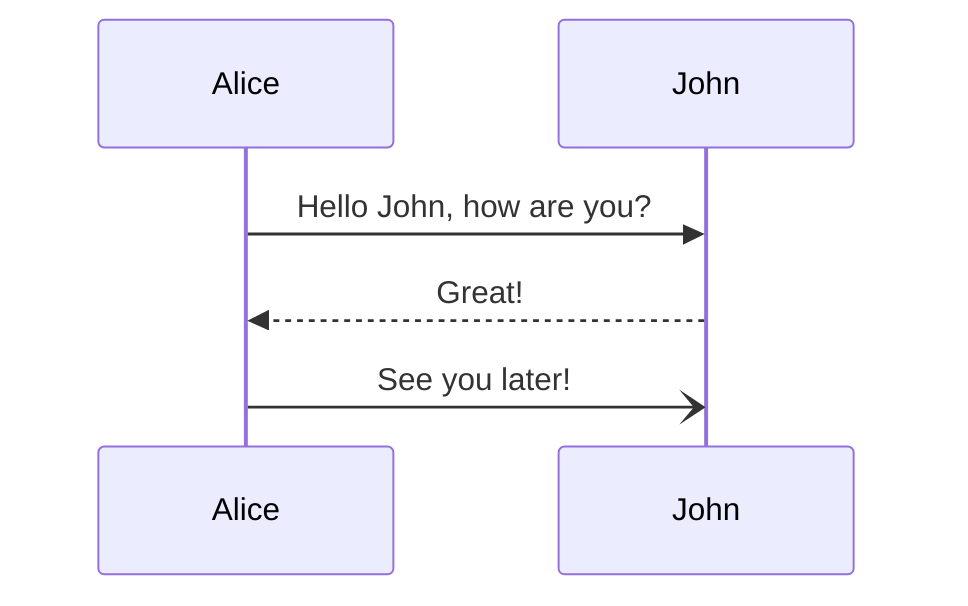
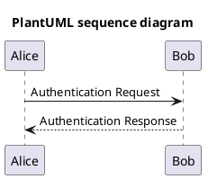

# Diagrams

## Mermaid embedded


```mermaid
sequenceDiagram
    Alice->>John: Hello John, how are you?
    John-->>Alice: Great!
    Alice-)John: See you later!

```

## PlantUML embedded


```puml
@startuml
title: PlantUML sequence diagram
Alice -> Bob: Authentication Request
Bob --> Alice: Authentication Response
@enduml
```

## PlantUML external

Using PlantUML with embedded code is not supported yet.

```
--8<-- "context.puml"
```


