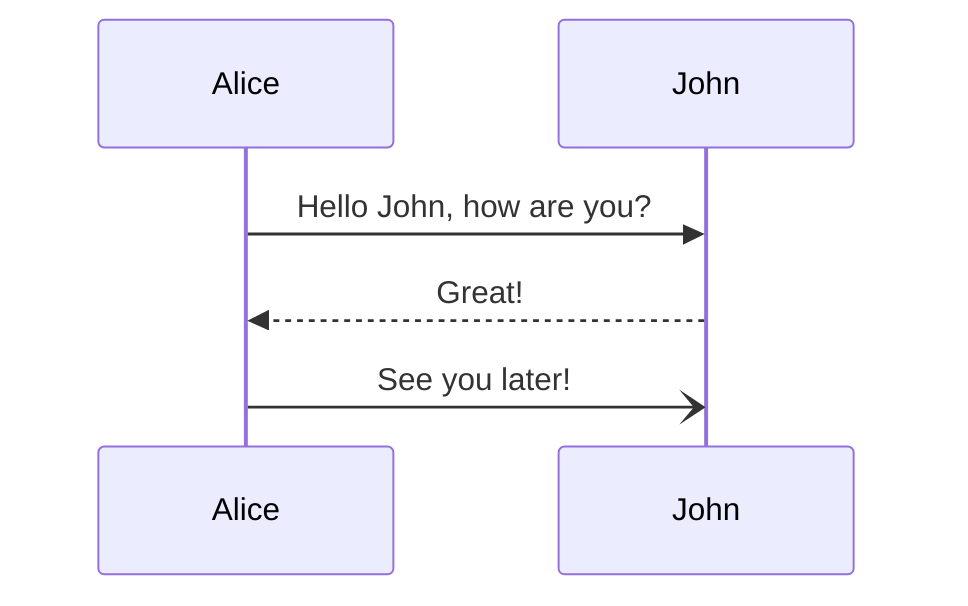
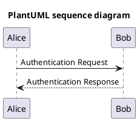
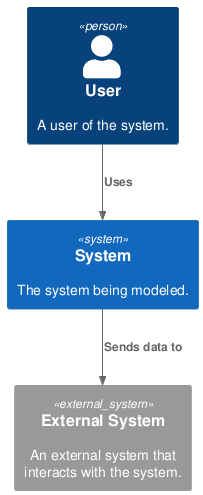

# Diagrams

## Mermaid embedded



## PlantUML embedded



## PlantUML external

!!! warning "External PlantUML files are not supported"

    Please note that loading puml from external files is not supported yet.
    Kudos to `mkdocs_puml` plugin: they are [planning](https://github.com/MikhailKravets/mkdocs_puml/issues/89) to enhance it.

```
--8<-- "context.puml"
```


